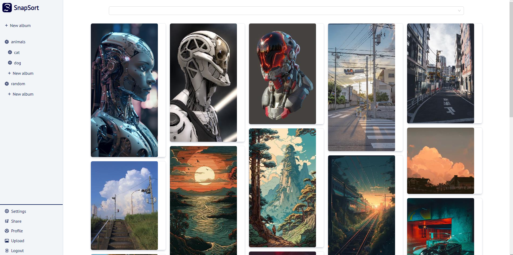

## Overview

SnapSort is a full-stack application developed using Java Spring and Next.js. It provides a platform for users to organize and sort their photos.

## Screenshots



## Technologies

- Java Spring
- Next.js
- Ant Design (antd)
- Axios
- Formik
- NextAuth.js
- React
- Styled Components
- TypeScript
- Yup

## Features

- User authentication and registration
- Uploading and managing photos
- Organizing photos into albums
- Adding tags to photos for categorization
- Sorting and filtering photos based on various criteria

## Prerequisites

Before setting up the project, make sure you have the following prerequisites installed:

### Frontend

- Node.js

### Backend

- Java (version 17)
- MySQL
- Maven

## Development

### Backend

1. Build the backend application. Open a terminal and navigate to the root directory of the backend project. Run the following command:
   `mvn clean install`

> Note: The build may fail initially, but we will set up the necessary configurations next.

2. Download and install MySQL or set up a MySQL database locally using Docker.

3. Set up a username and password for the MySQL database.

4. Create a MySQL database named "snap-sort".

5. Open IntelliJ IDEA and go to **Run > Edit Configurations**.

6. In the "SnapSortApplication" configuration, under the "Environment variables" section, add the following environment variables:

```
db_password=<your MySQL password>;
db_port=<port the database runs at>;
db_username=<your MySQL username>;
db_name=snap-sort;
jwt_secret=<secret jwt key>
```

For example:

`db_password=123;db_port=3306;db_username=root;db_name=snap-sort;jwt_secret=somesecretkeygenerated`

7. Build and run the application. It should start at port 8080.

### Frontend

1. Navigate to the frontend directory in a terminal:
   `cd frontend`

2. Install the frontend dependencies:
   `npm install`

3. Create a `.env` file in the frontend directory.

4. In the `.env` file, add the following environment variables:

```
NEXTAUTH_URL="http://localhost:3000/"
NEXTAUTH_SECRET="<generated secret>"
```

5. Start the frontend development server:
   `npm run dev`

The application should start at port 3000.

###

_Make sure to replace <your MySQL password>, <port the database runs at>, and <your MySQL username> with your actual database credentials. Also, replace <generated secret> with the appropriate values for the JWT secret and NextAuth secret._

## Directory Structure

- **/backend**: Contains the Java Spring backend code

- **/frontend**: Contains the Next.js frontend code

## License

SnapSort is licensed under the [MIT License](LICENSE)

## API Reference

<details>
  <summary>API References</summary>

#### Rename Album

```http
  PUT /api/albums/{albumId}/rename
```

| Parameter | Type      | Description                             |
| :-------- | :-------- | :-------------------------------------- |
| `albumId` | `integer` | **Required**. ID of the album to rename |
| `name`    | `string`  | **Required**. New name for the album    |

#### Upload Photo

```http
  POST /photos/upload
```

| Parameter     | Type     | Description                                 |
| :------------ | :------- | :------------------------------------------ |
| `file`        | `file`   | **Required**. The photo file to be uploaded |
| `description` | `string` | Description of the photo (optional)         |

#### Get Thumbnail Photo

```http
  GET /photos/{id}/thumbnail
```

Retrieves the thumbnail of a photo with the specified id.
| Parameter | Type | Description |
| :-------- | :------- | :-------------------------------- |
| `id` | `integer` | **Required**. ID of the photo|

#### Get Photo by ID

```http
  GET /photos/{id}
```

Retrieves a photo with the specified id.
| Parameter | Type | Description |
| :-------- | :------- | :-------------------------------- |
| `id` | `integer` | **Required**. ID of the photo|

#### Add Tag to Photo

```http
  POST /photos/{photoId}/tags/{tagId}
```

Adds a tag with tagId to a photo with photoId.
| Parameter | Type | Description |
| :-------- | :------- | :-------------------------------- |
| `photoId` | `integer` | **Required**. ID of the photo|
| `tagId` | `integer` | **Required**. ID of the tag to be added to photoo|

#### Upload Multiple Photos with Album and Tags

```http
  POST /photos/upload/multiple
```

Uploads multiple photos with an album and tags.
| Parameter | Type | Description |
| :-------- | :------- | :-------------------------------- |
| `files` | `array` | **Required**. Array of photo files to be uploaded|
| `tags` | `string` | Tags to be added to the photos (comma-separated)|
| `albumId` | `integer` | ID of the album to add the photos to|

#### Delete Photo

```http
  DELETE /photos/{id}
```

Deletes a photo with the specified id.
| Parameter | Type | Description |
| :-------- | :------- | :-------------------------------- |
| `id` | `integer` | **Required**. ID of the photo to delete|

#### Change Tags for Photo

```http
  POST /photos/{photoId}/tags
```

Changes the tags for a photo with the specified photoId.
| Parameter | Type | Description |
| :-------- | :------- | :-------------------------------- |
| `photoId` | `integer` | **Required**. ID of the photo to change tags|

#### Save Photo to Album

```http
  POST /api/albums/{albumId}/photos/{photoId}

```

Saves a photo with photoId to an album with albumId.
| Parameter | Type | Description |
| :-------- | :------- | :-------------------------------- |
| `albumId` | `integer` | **Required**. ID of the album to save the photo|
| `photoId` | `integer` | **Required**. ID of the photo to be saved to album|

#### Get All Thumbnails of Logged User's Photos

```http
  GET /photos/thumbnails
```

Retrieves all the thumbnails of photos belonging to the logged user.

#### Get Thumbnails of Photos in Album

```http
 GET /photos/album/{albumId}/thumbnails
```

Retrieves all the thumbnails of photos in an album with the specified albumId.
| Parameter | Type | Description |
| :-------- | :------- | :-------------------------------- |
| `albumId` | `integer` | **Required**. ID of the album|

#### Add Tag

```http
 POST /tags/create
```

Retrieves all the thumbnails of photos in an album with the specified albumId.
| Parameter | Type | Description |
| :-------- | :------- | :-------------------------------- |
| `name` | `string` | **Required**. Name of the new tag|

#### Get All Tags of Logged User

```http
 GET /tags/all
```

Retrieves all the tags of the logged user.

#### Delete Tag and Connections

```http
 DELETE /tags/{tagId}
```

Deletes a tag with the specified tagId and its connections.
| Parameter | Type | Description |
| :-------- | :------- | :-------------------------------- |
| `tagId` | `integer` | **Required**. ID of the tag to delete|

</details>

## Authors

- [@filus4](https://github.com/filus4)
- [@patkub2](https://github.com/patkub2)
